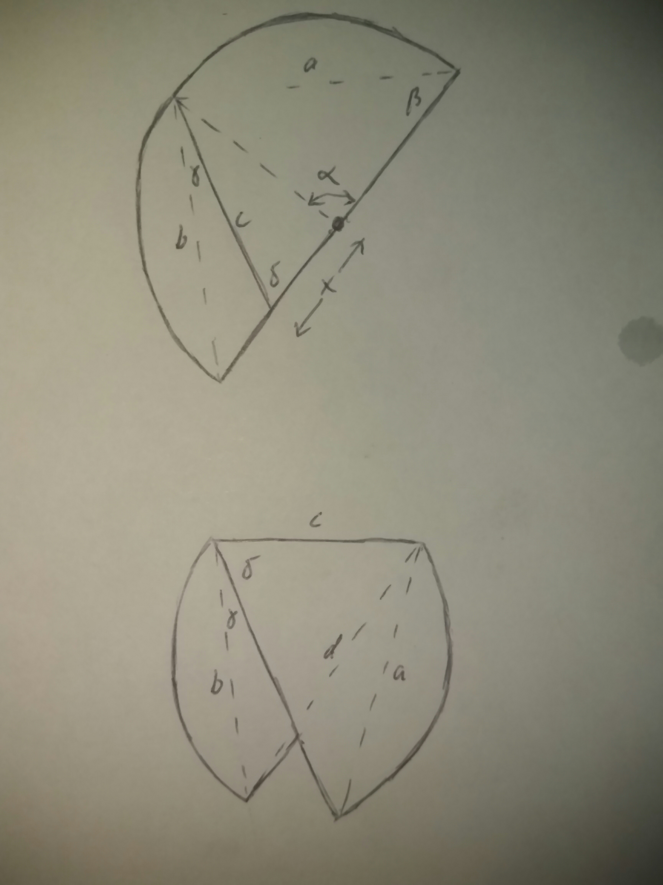

See: [The Riddler](https://fivethirtyeight.com/features/can-you-eat-all-the-chocolates/)

Let `x` be the distance and `alpha` the angle of the endpoints of the cut measured with respect to the former center of the pizza.



After repositioning the pieces as shown in the figure, minimize the radius of the circumscribed circles of the triangles with sides (a, c, 1+x) and (b, c, d):

```python
from scipy import optimize as opt
from operator import sub
import math as m

def radius(a, b, c):
    s = (a + b + c) / 2
    A4 = 4 * m.sqrt(s * (s-a) * (s-b) * (s-c))
    return a * b * c / A4
    
calc_side = lambda a, b, alpha: m.sqrt(a**2 + b**2 - 2*a*b * m.cos(alpha))
calc_angle = lambda a, b, c: m.acos((a**2 + b**2 - c**2) / (2*a*b))

def pizza(x, alpha):
    a = m.sqrt(2 - 2 * m.cos(alpha))
    beta = .5 * (m.pi  - alpha)
    b, c = calc_side(2, a, beta), calc_side(1+x, a, beta)
    gamma, delta = calc_angle(b,c, 1-x), calc_angle(1+x, c, a)
    d = calc_side(b, c, gamma + delta)
    return radius(b, c, d), radius(1+x, c, a)

def optpizza(alpha):
    x = opt.brentq(lambda x: sub(*pizza(x, alpha)), 0, 1)
    return 10 * sum(pizza(x, alpha)) / 2

opt.minimize(optpizza, m.pi/2)

      fun: 8.159942863841396
 hess_inv: array([[0.22619653]])
      jac: array([6.31809235e-06])
  message: 'Optimization terminated successfully.'
     nfev: 12
      nit: 2
     njev: 4
   status: 0
  success: True
        x: array([1.61841528])
```

The solution for `alpha` is `1.6184` which gives `0.56776` for `x` and `8.16` for the diameter of the circles. 
